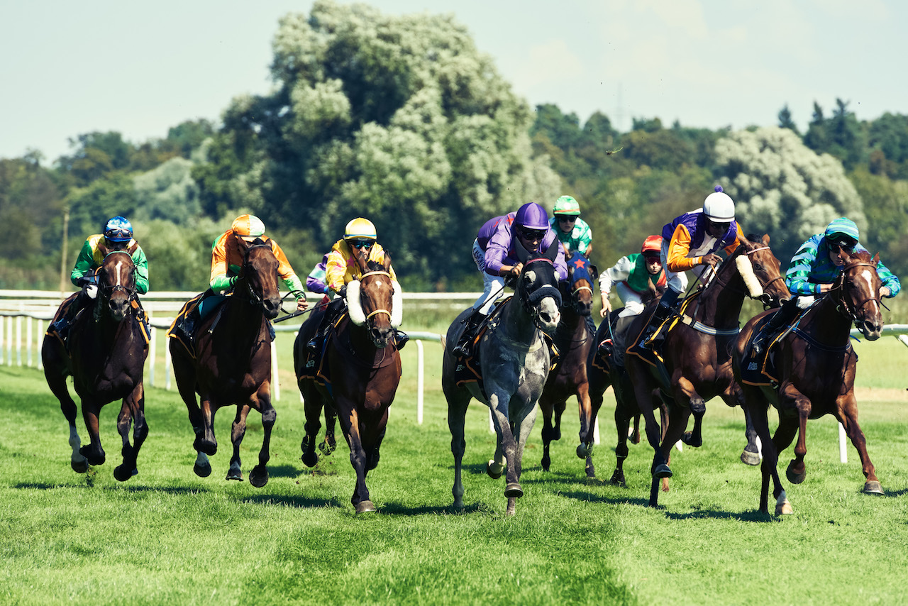

*Image taken by Tobias Klein, all rights reserved.*
# p-source

This repository has the code files behind the articles that I post on my
portfolio website.

Source code and files, that are the 'raw' parts of the articles I post on my
personal portfolio website
[*www.deep-learning-mastery.com*](https://deep-learning-mastery.com/).

The main topics of the articles are machine learning, parts of data science and
databases. Source code is written in python.

The names of the folders are the same as the corresponding article, that the
source files belong to used on the website.

Folders belong to articles posted in the following categories:
- [*Projects*](https://deep-learning-mastery.com/projects/)
- [*Blog*](https://deep-learning-mastery.com/blog/)
